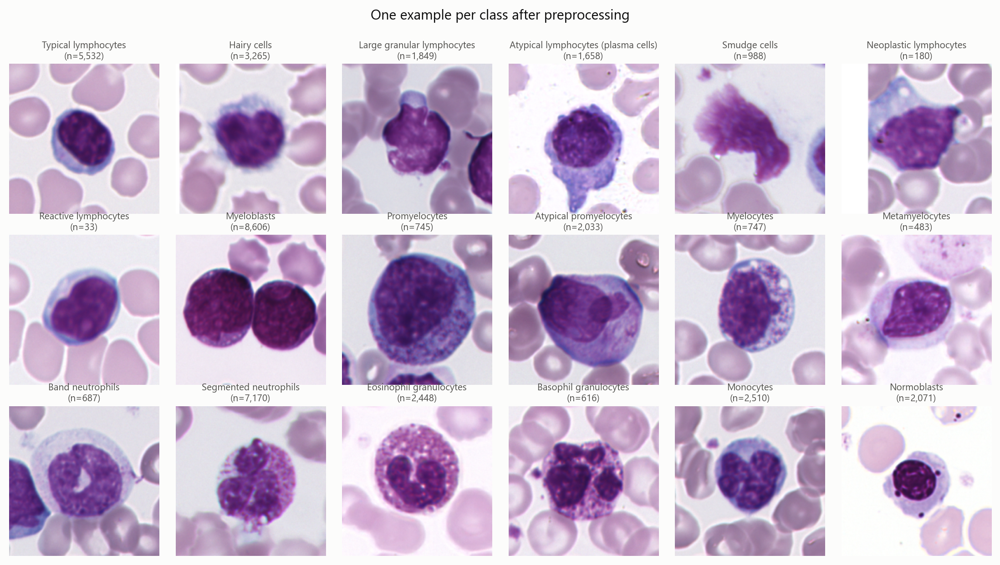
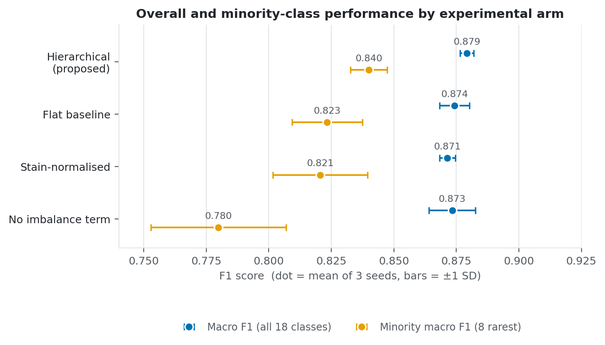

# Lineage-Aware Hierarchical Deep Learning for Imbalanced Multi-Class Classification of Peripheral Blood Cells

Master's dissertation project by **Arthiga Karthigesu**.

Classifying 18 types of peripheral blood cell from single-cell microscopy images, where the
largest class outnumbers the smallest **260 : 1**. The question is whether making the model
aware of *haematopoietic lineage* — the biological grouping above the cell type — improves
fine-grained classification, especially for the rare cell types that matter clinically and
that a flat classifier tends to ignore.

This repository holds both the implementation and the written dissertation sources.



<sub>**The task.** One representative cell per class, with its count in the corpus. The myeloid
stages along the lower rows differ only by gradual shifts in nuclear shape, chromatin density and
granularity — no single feature separates them. Counts run from 8,606 myeloblasts down to 33
reactive lymphocytes.</sub>

<table>
<tr><td><b>Dataset</b></td><td>MLL23 — 41,621 images, 18 classes · <a href="https://doi.org/10.5281/zenodo.14277609">10.5281/zenodo.14277609</a> (CC BY 4.0)</td></tr>
<tr><td><b>Backbone</b></td><td>ViT-Small/16, ImageNet-pretrained, fine-tuned at 224×224</td></tr>
<tr><td><b>Headline</b></td><td>Test macro F1 <b>0.879</b> · minority-class macro F1 <b>0.840</b></td></tr>
<tr><td><b>Compute</b></td><td>24.2 GPU-hours for the full 12-run matrix, single RTX 4070 Laptop (8 GB)</td></tr>
<tr><td><b>Project page</b></td><td><code>docs/index.html</code> — self-contained, deployable to GitHub Pages</td></tr>
</table>

---

## Research question

> Does a lineage-aware hierarchical classifier, combined with an imbalance-robust training
> objective, improve fine-grained classification of single peripheral blood cell images —
> especially for rare cell types — compared with a flat transfer-learning classifier on the
> same data?

---

## Results

Five experiments, one backbone (ViT-Small/16), identical splits, three training seeds each,
30 epochs per run. Mean over seeds; the test set was held out until final evaluation.

| Arm | Macro F1 | Balanced acc. | Minority F1 | Minority recall | Cross-lineage err. |
|---|---:|---:|---:|---:|---:|
| **Hierarchical** (proposed) | **0.8792** ± 0.0028 | **0.8936** | **0.8400** | **0.7987** | 0.0115 |
| Flat baseline *(= hierarchy ablation)* | 0.8742 ± 0.0060 | 0.8832 | 0.8233 | 0.7761 | 0.0119 |
| − imbalance term | 0.8733 ± 0.0093 | 0.8620 | 0.7799 | 0.7226 | **0.0104** |
| Stain-normalised (Reinhard) | 0.8714 ± 0.0031 | 0.8832 | 0.8206 | 0.7753 | 0.0127 |



<sub>The two columns have to be read together. On overall macro F1 the four arms are separated by
0.008 in total and their error bars overlap everywhere; on the minority classes the same four
spread across 0.060 and the ordering changes. Note the last table row: removing the imbalance term
gives the **best accuracy** of any arm (0.9602) and the **worst** minority F1 (0.7799).</sub>

### What the evidence supports

**The hierarchical model is best on every metric the research question concerns**, and the
effect is consistent across four independent measures:

| Hierarchical − flat baseline | Δ | p | Cohen's d |
|---|---:|---:|---:|
| Macro F1 | +0.0050 | 0.42 | +0.57 |
| Balanced accuracy | +0.0103 | 0.20 | +1.08 |
| Minority macro F1 | +0.0167 | 0.28 | +0.84 |
| Minority recall | +0.0226 | 0.21 | +1.04 |

**No comparison reaches p < 0.05.** With three seeds the paired t-test has 2 degrees of
freedom; at the observed effect sizes it has roughly 15–20% power, so it was always more
likely to miss a real effect than to find one. Reaching 80% power would need about **10–13
seeds**. Four metrics moving the same direction with moderate-to-large effect sizes is
suggestive, but this study does not establish the hierarchy's benefit at conventional
significance.

**The imbalance-robust objective is the dominant component.** Removing it costs 0.076
minority recall (p = 0.024, d = −3.67) and 0.032 balanced accuracy (p = 0.028, d = −3.37) —
the largest effects in the study by a wide margin, and roughly an order of magnitude beyond
the hierarchy's own contribution. These are also the only method comparisons that clear
p < 0.05. The dissertation's title leads with the hierarchy, but the imbalance treatment
is doing most of the work.

**Stain normalisation did not help.** Against the flat baseline it is indistinguishable
(balanced accuracy 0.8832 vs 0.8832, p = 1.00); against the proposed model it is consistently
worse on every metric (macro F1 −0.008, minority F1 −0.019) though never significantly.

**Cross-lineage error is the only p < 0.05 result** (hierarchical vs flat, p = 0.0198,
d = −4.04) — but read the magnitude before the p-value: 0.0115 vs 0.0119 is a difference of
about **2.5 images out of 6,244**. It is significant only because the variance is now
minuscule (sd ≈ 0.0007). Statistically detectable, practically negligible; the write-up must
state both.

### A methodological finding: macro F1 is the wrong headline metric

Removing the imbalance term changes:

```
macro precision   +0.0170     ← rises
macro recall      −0.0316     ← falls
                  ─────────
macro F1          −0.0059     ← cancels out  (p = 0.44)
balanced accuracy −0.0316     ← no cancellation (it IS macro recall)
plain accuracy    +0.0035     ← rises
```

Without class re-weighting the model becomes conservative about rare classes: recall falls,
but precision *rises* because it makes fewer false positives. F1 is the harmonic mean, so the
two effects partially cancel and **macro F1 is nearly blind to the intervention** — it reports
−0.006 (p = 0.44) where minority recall reports −0.076 (d = −3.67). Balanced accuracy is macro
recall, so nothing cancels.

Two consequences:

1. **Balanced accuracy and minority recall should lead the write-up**, not macro F1, despite
   CLAUDE.md designating macro F1 as headline.
2. **Model selection currently runs on that blind metric.** `engine.fit` selects checkpoints on
   validation macro F1. Re-selecting on balanced accuracy would change the chosen epoch in 5 of
   10 runs, but gains only ≈ +0.008 validation minority F1 on average — real, small, and not
   worth a full re-run.

Note also that **plain accuracy *rises* (+0.0035) when imbalance handling is removed** — the
exact failure mode this dissertation exists to study, demonstrated on its own runs rather than
merely asserted.

**Backbone screen** (6 epochs each, selection on validation macro F1):

| Backbone | Val macro F1 | Minutes |
|---|---:|---:|
| **ViT-Small/16** ← selected | **0.8489** | 25.8 |
| ConvNeXt-Tiny | 0.8461 | 89.7 |
| MobileNetV3-Large | 0.8392 | 18.0 |
| ResNet-50 | 0.8353 | 44.9 |

Six epochs need not rank backbones the way a full run would. This is a *selection* step, not
the backbone comparison result.

Total compute: **12 runs, 24.2 GPU-hours** on an RTX 4070 Laptop (8.6 GB).

---

## A note on the first experiment matrix

An earlier complete matrix (archived in [archive/v1_baseline/](archive/v1_baseline/)) produced
weaker numbers **and the opposite conclusion** about rare cell types. It was invalid, for
reasons unrelated to the methods under test. This is documented because the failure is
instructive, and because the corrected result depends on understanding it.

**Run length, not method, drove the v1 rankings** — `corr(epochs_run, test_macro_f1) = +0.87`.
The cosine LR schedule was defined over 50 configured epochs while early stopping fired at
12–37, so runs halted at up to **86% of peak learning rate**, never annealed. Early stopping
was itself firing on noise: validation macro F1 moved with sd 0.021 between consecutive epochs
while the effects under study were 0.008–0.028. **The measurement noise exceeded the effect
size**, so no number of seeds could have made v1 conclusive.

Correcting the protocol — fixed 30-epoch budget so cosine completes, weight EMA, TTA,
RandAugment + CutMix — lifted every arm and cut seed-to-seed variance up to 8×:

| Arm | Macro F1 v1 → v2 | Minority F1 v1 → v2 | Seed sd v1 → v2 |
|---|---|---|---|
| flat_baseline | 0.8447 → 0.8742 | 0.8191 → 0.8233 | 0.0262 → 0.0060 |
| hierarchical | 0.8532 → 0.8792 | 0.7909 → **0.8400** | 0.0141 → 0.0028 |
| no_imbalance | 0.8238 → 0.8733 | 0.7106 → 0.7799 | 0.0115 → 0.0093 |
| stain_norm | 0.8235 → 0.8714 | 0.7582 → 0.8206 | 0.0207 → 0.0031 |

**Two v1 conclusions reversed sign.** v1 reported the hierarchy *reducing* minority F1 by 0.028
and balanced accuracy by 0.010; with the protocol fixed both flip positive (+0.017, +0.010).
The v1 finding that "the dissertation's central claim about rare cell types is not supported"
was an artifact of the flat baseline being the arm least penalised by the truncated schedule.

Also fixed: `aug_policy` was a **dead config field** — `build_loaders` never passed it to the
dataset, so every v1 run trained on the `basic` policy regardless of what its config recorded.
The `aug_policy` column in v1's `summary.csv` is fiction.

---

## Dataset

**MLL23** peripheral blood single-cell dataset (*Scientific Data*, 2025) —
[10.5281/zenodo.14277609](https://doi.org/10.5281/zenodo.14277609).

41,621 Pappenheim-stained single nucleated-cell images, 288×288 px TIFF (25 µm × 25 µm),
annotated by expert cytomorphologists into 18 classes across 3 lineages.

```
Lymphoid  (13,505)   typical lymphocytes 5,532 · hairy cells 3,265 · large granular 1,849
                     plasma cells 1,658 · smudge 988 · neoplastic 180 · reactive 33
Myeloid   (26,045)   myeloblasts 8,606 · segmented neutrophils 7,170 · monocytes 2,510
                     eosinophils 2,448 · atypical promyelocytes 2,033 · myelocytes 747
                     promyelocytes 745 · band neutrophils 687 · basophils 616
                     metamyelocytes 483
Erythroid  (2,071)   normoblasts 2,071
```

Two things about this ordering are deliberate and must not be "tidied":

1. **The imbalance is the subject matter, not an obstacle.** It is handled in the loss and left
   intact in the data. Do not resample it away.
2. **Myeloid classes follow the maturation continuum** (myeloblast → promyelocyte → myelocyte →
   metamyelocyte → band → segmented). Confusion matrices plotted in index order therefore place
   biologically adjacent stages next to each other, which is exactly where the clinically
   expected errors land.

> **Data lives at `D:\MLL23`, not in this repository** (~10 GB extracted, plus ~21 GB of decode
> caches). Override the location with the `MLL23_ROOT` environment variable.

---

## Method

```
                     288×288 TIFF
                          │  resize 224×224, ImageNet normalisation
                          │  train only: RandAugment + flips/rotation
                          │             (intensified for minority classes), CutMix
                          ▼
        ┌──────────────────────────────────┐
        │  shared pretrained backbone      │   ViT-Small/16
        └──────────────────────────────────┘
                    │            │
        head_lineage│            │head_fine
         Linear(→3) │            │Linear(→18)
                    ▼            ▼
                 logits₁      logits₂
```

Trained jointly with a single objective:

```
L = λ_lin·L(logits₁, y₁) + λ_fine·L(logits₂, y₂) + λ_cons·KL(marginalised fine ‖ lineage)
```

The **consistency term** is what makes this hierarchical rather than merely multi-task: it
marginalises the fine posterior into lineage space and penalises disagreement with the lineage
head. Without it the two heads can contradict each other freely, and the claim that "the coarse
decision regularises the fine one" has no mechanism behind it.

`λ_cons` is deliberately small (0.1). Notebook 02 measured the lineage structure and found it
**local, not global** — lineage silhouette ≈ 0, but k-NN lineage agreement ≈ 0.78 against a
~0.45 chance baseline. So the lineage head is a *regulariser, not a gate*: a hard gate routing
samples to per-lineage sub-classifiers would assume a separability the data rejects, and every
gate misfire would be an unrecoverable cross-lineage error.

> **Known limitation of this design.** By the end of training the lineage head reaches ~98.9%
> accuracy and both auxiliary losses collapse to ≈ 0.0007 — the hierarchy stops contributing
> gradient well before training ends. Lineage is the *easy* axis; the hard problem is
> discrimination *within* a lineage. That the hierarchy still helps at all is notable, but it
> caps how much it can help. See "Further work" below.

### The five experiments

All arms are the same `ExperimentConfig` with different field values — one training loop, no
per-variant scripts.

| # | Arm | mode | hierarchy | imbalance | stain norm |
|---|---|---|---|---|---|
| 1 | Flat baseline | flat | ✗ | ✓ | — |
| 2 | Full hierarchical | hier | ✓ | ✓ | — |
| 3 | Ablation − imbalance | hier | ✓ | **✗** | — |
| 4 | Ablation − hierarchy | flat | **✗** | ✓ | — |
| 5 | Stain-normalised | hier | ✓ | ✓ | **Reinhard** |

> **Experiments 1 and 4 are the same model.** "The hierarchical model with the hierarchy
> removed" *is* the flat single-head baseline. It is trained once and reported twice — four
> distinct configurations, not five.

---

## Requirements

Verified on the environment below. The versions are not aspirational — they are what the
reported results were produced on.

| | Version | Note |
|---|---|---|
| **Python** | **3.12.3** (CPython) | 3.10+ should work; 3.12 is what is tested |
| **PyTorch** | 2.6.0+cu124 | CUDA 12.4 build |
| **torchvision** | 0.21.0 | supplies `transforms.v2`, RandAugment, CutMix |
| **timm** | 1.0.16 | backbone zoo |
| NumPy | 2.3.5 | pinned `<2.4` — `umap-learn` downgrades anything newer |
| pandas · scikit-learn · SciPy | 2.2.3 · 1.7.0 · 1.16.0 | SciPy supplies the paired *t*-tests |
| Pillow · matplotlib | 12.2.0 · 3.10.3 | |
| python-docx | 1.2.0 | only for `scripts/build_dissertation/` |

**Hardware used:** NVIDIA RTX 4070 Laptop, 8 GB VRAM, Windows 11. The 8 GB ceiling sets the
batch size of 64; nothing here needs a larger card, only more time.

`torch` and `torchvision` carry a `+cu124` local tag and will not resolve from PyPI. Install
them from the PyTorch index first:

```bash
conda create -n mll23 python=3.12 && conda activate mll23
pip install torch==2.6.0 torchvision==0.21.0 --index-url https://download.pytorch.org/whl/cu124
pip install -r requirements.txt
```

CPU-only works for everything except training — drop the `--index-url` line and expect the
experiment matrix to be impractical.

**Storage.** The corpus is ~10 GB extracted and the decoded-image caches another ~21 GB, so
budget **~31 GB on a non-system drive**. Data location is set by `MLL23_ROOT` and defaults to
`D:\MLL23`; neither the corpus nor the caches are ever written into the repository.

---

## Quick start

```bash
# 1. Fetch the corpus (~9.1 GB of archives). Resumable and idempotent.
python -c "from src.download import download_all; download_all()"

# 2. Build manifest, verify counts, create the deterministic split.
jupyter notebook notebooks/01_data_preparation.ipynb

# 3. Build the decoded-image caches (~14 min, ~21 GB on D:). Idempotent.
python scripts/build_caches.py

# 4. Prove every code path runs, in about two minutes.
python -m src.experiments --phase smoke

# 5. Backbone screen, then the five experiments.
python -m src.experiments --phase screen --epochs 6
python -m src.experiments --phase main --backbone vit --epochs 30
```

Both training phases are **resumable**: `run_matrix` skips any run already present in
`results/summary.csv`, so re-running after an interruption costs only the unfinished runs.
This was exercised in practice — a CUDA OOM on run 11 of 12 cost only the run in flight.

---

## Repository layout

```
src/
  config.py       paths, resolution, split fractions, augmentation strength
  hierarchy.py    the 18 classes, lineages, index ordering        <- start here
  download.py     Zenodo fetch, MD5 verify, extract
  manifest.py     build/verify the image manifest
  splits.py       deterministic stratified 70/15/15
  transforms.py   288->224 pipeline, class-conditional augmentation
  cache.py        uint8 memmap of decoded 288px images (raw + Reinhard)
  dataset.py      MLL23Dataset yielding (image, y1, y2)
  mixing.py       hierarchical MixUp/CutMix (one lambda across both label levels)
  stain.py        Macenko + Reinhard normalisation (fit on train only)
  features.py     frozen-backbone embeddings for EDA
  quality.py      per-image stats, near-duplicate detection, hierarchy tests
  models.py       HierarchicalClassifier: shared backbone -> two heads
  losses.py       class-balanced weights, focal loss, HierarchicalLoss  <- ablations here
  metrics.py      macro/balanced metrics + within- vs cross-lineage error split
  engine.py       ExperimentConfig, EMA, TTA, and the single training loop
  experiments.py  the arms declared as data; CLI entry point
  stats.py        paired t-tests across seeds, Cohen's d
  gradcam.py      saliency over the final backbone stage (ViT-aware)
  viz.py          figures for the write-up
scripts/
  build_caches.py                one-time cache build; idempotent
  make_notebooks.py              regenerates notebooks 03-05 from source
  analyse_maturation_adjacency.py  stage-distance analysis of myeloid errors
  build_project_page.py          builds docs/index.html + docs/artifact.html
  build_dissertation/            python-docx build of the dissertation
notebooks/
  01_data_preparation.ipynb    acquire, verify, split
  02_dataset_analysis.ipynb    hierarchy tests, stain norm, duplicates, augmentation
  03_model_and_training.ipynb  architecture, loss checks, overfitting test
  04_experiments.ipynb         backbone screen + five arms + significance
  05_evaluation.ipynb          confusion matrices, per-class, Grad-CAM
docs/
  index.html      project page, self-contained (GitHub Pages entry point)
  thesis/         Dissertation.docx + Methodology, Literature_Review (.tex/.pdf)
  slides/         proposal and progress decks (.tex/.pdf)
  assets/         hand-drawn figure PDFs the LaTeX sources include
  specs/          modelling-pipeline design spec
results/        summary.csv (one row per run), history_*.csv, per-class tables
artifacts/       generated figures
archive/        v1_baseline/ - the superseded first matrix, kept as evidence
checkpoints/    best.pt per run, selected on validation macro F1  (gitignored)
```

`docs/thesis/Dissertation.docx` is **generated, not hand-edited** — rebuild it with
`python scripts/build_dissertation/build.py` after editing the chapter modules, or your
changes will be overwritten.

Not in version control, with reasons recorded in `.gitignore`: the corpus and caches, model
weights, `references/` (third-party course handouts), and the 1.7 GB of superseded v1 weights.
The v1 *result CSVs* under `archive/` **are** tracked on purpose — the write-up argues from them.

[hierarchy.py](src/hierarchy.py) is the keystone — it declares the class indices, the lineage
mapping, and the published per-class counts. Its module-level `_validate()` runs at import and
fails loudly if the invariants break.

---

## Five traps worth knowing

Each of these ran fine while being wrong. All are commented at their site in the code and
detailed in [the design spec](docs/specs/2026-08-01-modelling-pipeline-design.md).

1. **Mixed precision must be bf16, not fp16.** An fp16 run reached val macro F1 0.80, then went
   NaN at epoch 3 and never recovered. Related: the `clamp_min(1e-8)` guard in the consistency
   term is a *no-op under fp16* — 1e-8 rounds to exactly zero at that precision.
2. **`backbone.num_features` is wrong for MobileNetV3** (reports 960; the real pooled width is
   1280). [models.py](src/models.py) measures it with a dummy forward instead.
3. **Grad-CAM on ViT must hook `blocks[-1].norm1`, not `blocks[-1]`.** timm's ViT pools the
   class token only, so patch-token gradients at the final block are *exactly zero* — producing
   a flat map that still looks like a legitimate figure. Measured: 0.0 vs 6.6e-2.
4. **Never hand an open `np.memmap` to a DataLoader worker.** Windows spawns workers, so the
   memmap is pickled in full — 10 GB per worker. Pass the path and map it lazily per process.
5. **Free the model between runs in a matrix.** A matrix trains every configuration in one
   process; model + EMA copy + AdamW momentum buffers accumulate until the allocator fragments.
   This exhausted 8 GB on run 11 of 12.

### Performance note

Without the decode cache the pipeline is **data-bound, not GPU-bound**: 178 img/s decoding
TIFFs at `num_workers=4`, and *slower* at 8 (119 img/s) from contention, against ~850 img/s
cached. `NUM_WORKERS = 4` is measured, not guessed. RandAugment roughly doubles per-epoch cost
(≈60 s → ≈101 s) because it runs on the CPU dataloader.

---

## Known limitations

- **Underpowered.** Three seeds gives 2 d.f.; at the observed effect sizes, power is ~15–20%.
  The hierarchy's benefit is directionally consistent across four metrics but not established
  at p < 0.05. Roughly 10–13 seeds would be needed.
- **CLAUDE.md specifies "paired t-test across validation folds", but there are no folds.**
  `splits.py` produces one fixed deterministic split, which must stay identical across arms for
  the ablations to mean anything. Paired samples come from retraining at multiple seeds instead.
- **Reactive lymphocytes (n = 33) leave ~23 training and ~5 test images.** Per-class F1 for this
  class moves in large increments — a single prediction flips it substantially. Report the
  number; do not build an argument on its movement between arms.
- **The backbone screen is a selection step**, not a controlled backbone comparison.
- `Data_Analysis.tex` still specifies 384×384 for Vision Transformers; the resolution was
  resolved to **224 for every backbone** so the comparison stays controlled.

## Further work

In priority order, from the diagnosis above:

1. **Make the hierarchy target an axis that is still hard.** The lineage head saturates at
   98.9%. Either factor the prediction as `p(y₂|x) = p(y₁|x)·p(y₂|y₁,x)` so the coarse decision
   genuinely constrains the fine one, or retarget the auxiliary task at myeloid *maturation
   stage*, where the residual confusion actually lives.
2. **Attack the tail directly** with decoupled training (cRT) — learn the representation with
   instance-balanced sampling, then retrain only the classifier with class-balanced sampling —
   or logit adjustment / LDAM margin loss.
3. **Raise statistical power** to 10–13 seeds on the two primary arms.

---

## Citation

```bibtex
@dataset{mll23,
  title  = {MLL23: A peripheral blood single-cell dataset},
  year   = {2025},
  doi    = {10.5281/zenodo.14277609},
  note   = {Scientific Data}
}
```
